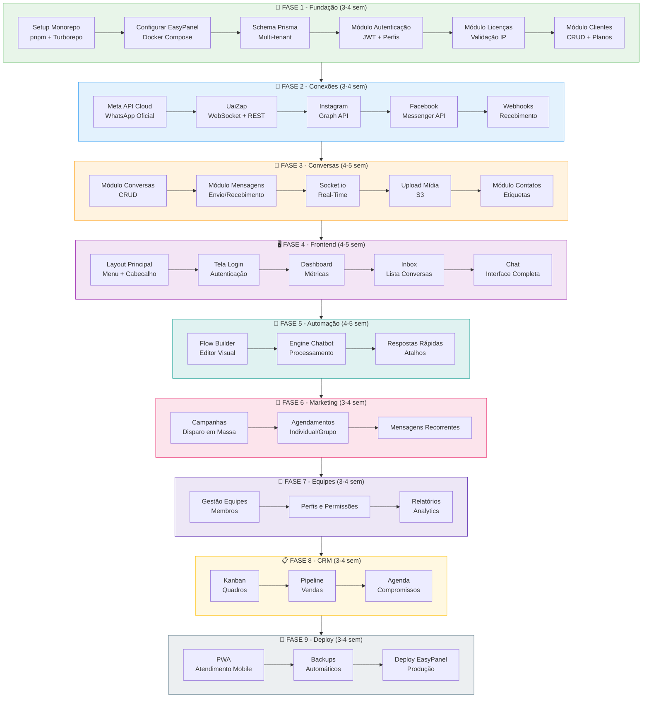
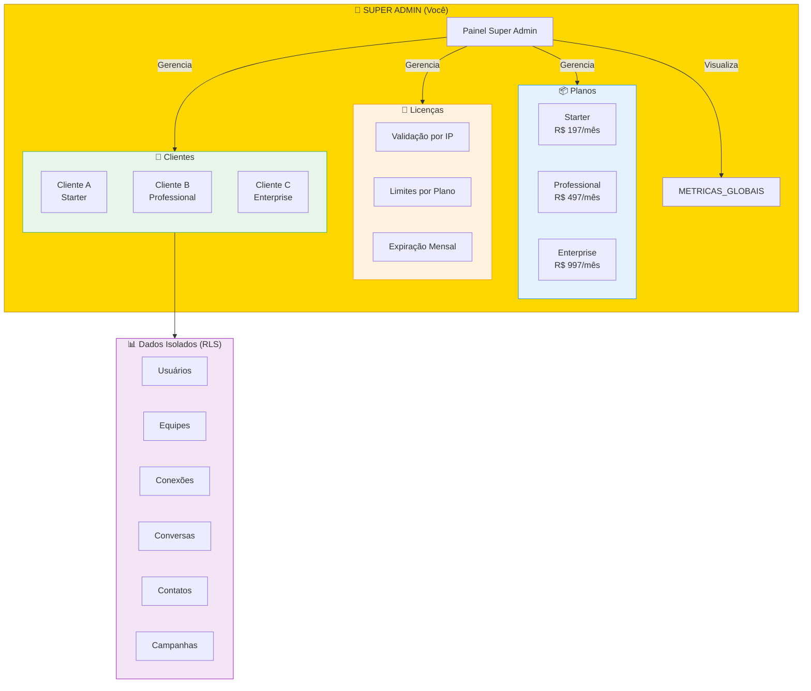
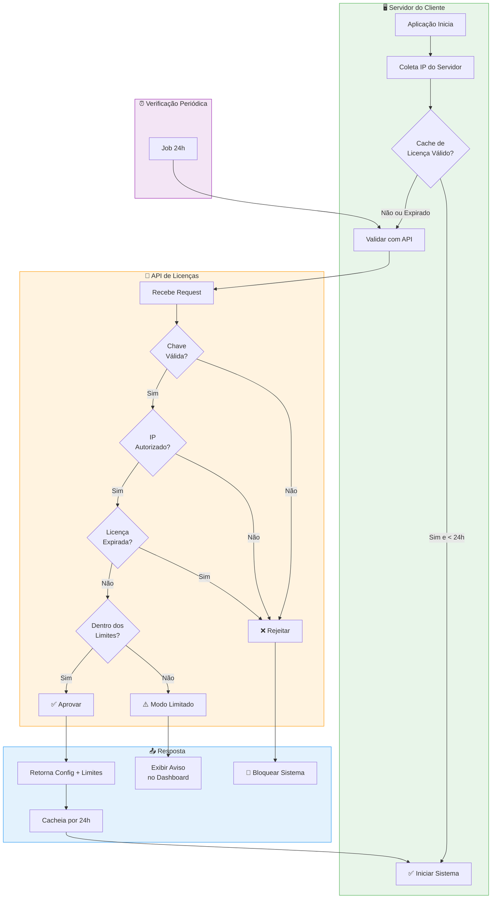
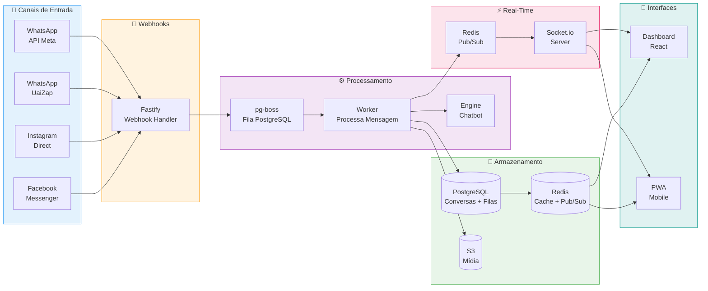
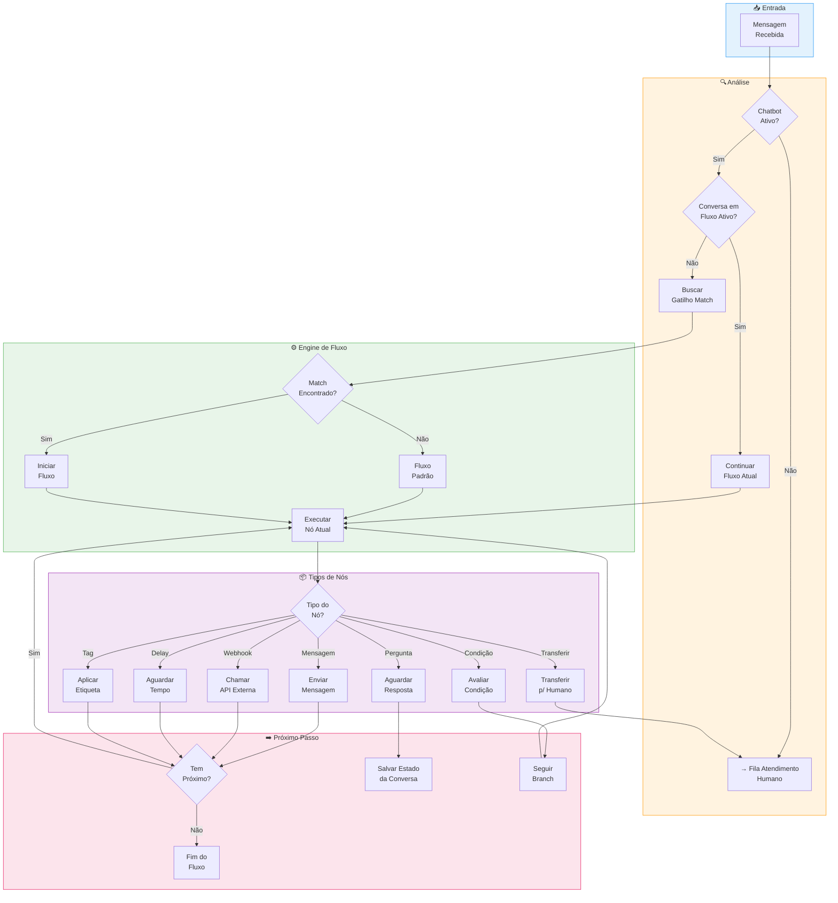
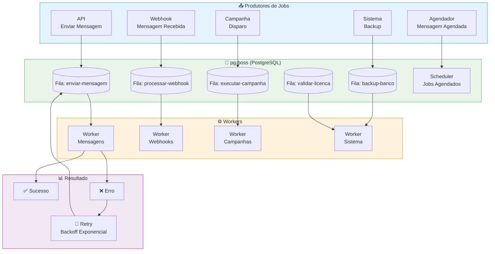
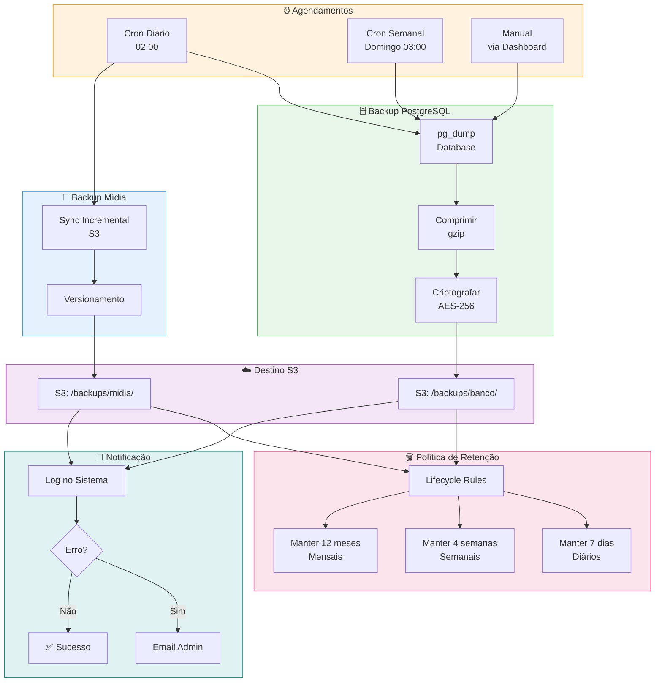
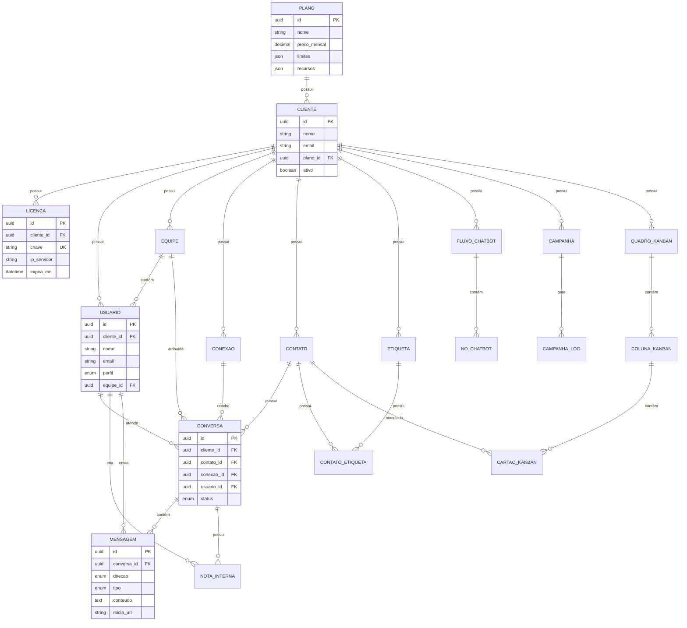

# 📊 Fluxogramas do Sistema - CRM WhatsApp Omnichannel

## 1. Fluxo de Desenvolvimento (Fases)

---

## 2. Arquitetura Multi-Tenant

---

## 3. Fluxo de Validação de Licença

---

## 4. Fluxo de Atendimento Real-Time

---

## 5. Fluxo do Engine de Chatbot

---

## 6. Fluxo de Filas com pg-boss

---

## 7. Fluxo de Backup Automático

---

## 8. Estrutura de Dados - Relacionamentos

---

*Fluxogramas atualizados com nomenclatura em português e arquitetura multi-tenant*
